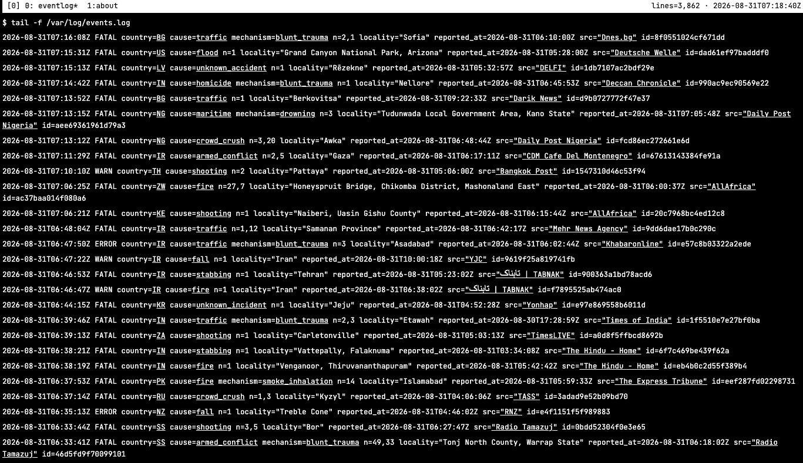

# EVENTLOGS

A record of specific events occurring around the world, organized by country, location, cause, scale, and source.

EVENTLOG provides a simple way to explore and review these events through a structured, continuously updated interface.

**Website:** https://www.eventlogs.org/

**Contact:** [contact@eventlogs.org](mailto:contact@eventlogs.org)
